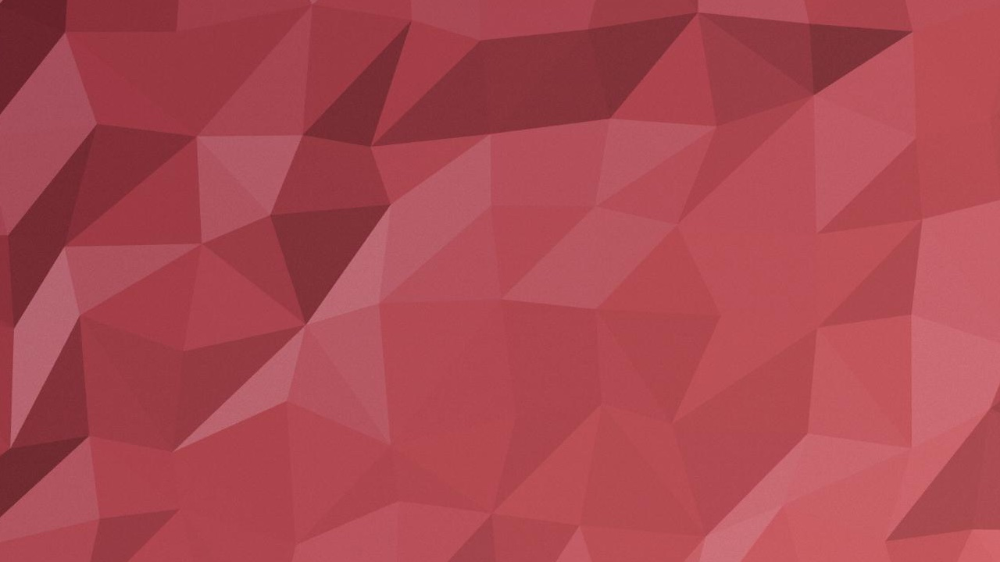

# velo-bg

Put a `<velo-bg>` tag on a page and it paints a low-poly triangle gradient behind whatever you place inside it. The result looks like the lid of a VELO can: a colour sweep broken into triangles, each one catching the light a little differently, with a fine grain over the top.

```html
<velo-bg gradient="315deg, #e84a5f, #a51c3a">
  <h1>Your content</h1>
</velo-bg>
```

## Why

I love VELO nicotine pouches, and I kept staring at the can instead of using it. The lid has this triangle pattern that I couldn't stop looking at, so I built a version of it for the browser.

It is a single import with no dependencies and no build step. Try it live at https://velo-bg.callback.systems.

## What you get

The canvas fills the element and sits behind its children, so headings, buttons and cards go on top as usual. Triangles are lit from one side, which makes the highlights and shadows cluster the way they do on a real crumpled surface instead of reading as random noise. A light film grain takes the flat digital edge off.

The element repaints whenever it is resized or one of its attributes changes, so you can bind the attributes from JavaScript or animate them. The same seed always draws the same mesh, which keeps a background stable across reloads and screenshots.

## Tuning it

| Attribute  | Default                    | What it does                                                                     |
| ---------- | -------------------------- | -------------------------------------------------------------------------------- |
| `gradient` | `315deg, #e84a5f, #a51c3a` | Arguments of a CSS `linear-gradient`. The angle sets the direction of the sweep. |
| `cell`     | `170`                      | Approximate triangle size in CSS pixels. Smaller cells mean busier surfaces.        |
| `jitter`   | `0.6`                      | How irregular the triangles are, `0` (a neat grid) to `1`.                          |
| `depth`    | `0.5`                      | Contrast between lit and shaded triangles, `0` (flat) to `1`.                       |
| `grain`    | `0.08`                     | Opacity of the film grain, `0` to `1`.                                           |
| `seed`     | `1`                        | Integer. Change it to get a different mesh with the same settings.               |

Any CSS colour works as a stop, and stops can carry positions: `gradient="45deg, tomato 10%, rgb(120 20 40) 90%"`. A full `linear-gradient(...)` string is accepted too.

The demo page has a slider for every attribute and shows the matching markup as you move them, ready to copy. It can also download the current background as a PNG or SVG. Run `npm run serve` and open http://localhost:4173.

## Exporting

Every element exposes what it drew. `png` resolves to a PNG blob at the screen's pixel density, and `svg` is the same mesh as vector markup with a turbulence filter standing in for the grain:

```js
const background = document.querySelector("velo-bg")
const blob = await background.png
const markup = background.svg
```

## Install

### Import map

Copy the folder into your project and map the bare name to `index.js`:

```html
<script type="importmap">
  { "imports": { "velo-bg": "./vendor/velo-bg/index.js" } }
</script>
<script type="module">import "velo-bg"</script>
```

`index.js` imports the modules in `src/` by relative path, so keep the folder together.

### Rails with importmap-rails

Copy `dist/velo-bg.js`, a single-file build, into `vendor/javascript/` and pin it:

```ruby
pin "velo-bg" # vendor/javascript/velo-bg.js
```

```js
import "velo-bg"
```

## Development

```bash
npm install
npm run serve   # demo at http://localhost:4173
npm run lint
npm run build   # regenerates dist/velo-bg.js
```
